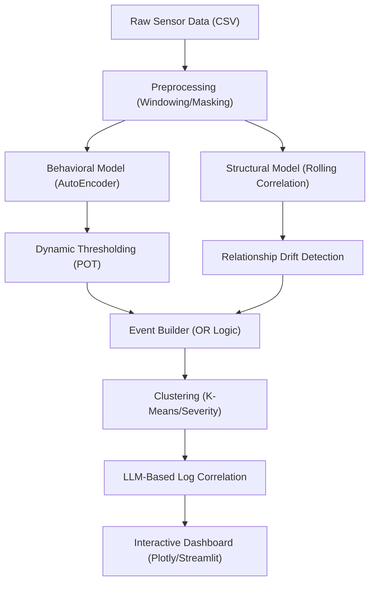

# Anomaly Detection & Diagnostic System

[](https://behackfest-svhjrashpisptdjz5kmjfw.streamlit.app/)

A powerful time-series anomaly detection system using AutoEncoders, Dynamic Thresholding (POT), and AI-powered diagnostics with an Interactive Plotly Dashboard.

🔗 **Live Demo**: [behackfest-svhjrashpisptdjz5kmjfw.streamlit.app](https://behackfest-svhjrashpisptdjz5kmjfw.streamlit.app/)

---

## 🛠️ Setup & Installation

```bash
pip install -r requirements.txt
```

## 🚀 How to Run

### 1. Generate Sample Data
```bash
python generate_data.py
```

### 2. Run CLI Pipeline (Dev Mode)
Generates static and interactive reports locally:
```bash
python demo_app.py
```
**Outputs:** `anomaly_dashboard.html`, `anomaly_events_plot.png`

### 3. Launch Web Dashboard
```bash
python -m streamlit run app.py
```
Access at: http://localhost:8502

---

## 🏗️ System Architecture



---

## 🧠 Core Components

| Component | Description |
|---|---|
| **AutoEncoder** | Neural network trained on normal data; high reconstruction error = behavioral anomaly |
| **Rolling Correlation** | Monitors sensor relationships; divergence = structural anomaly |
| **Peak Over Threshold (POT)** | Dynamic thresholding that adapts to noise levels |
| **LLM Diagnostics** | AI-powered root cause analysis using Groq / Gemini / OpenAI |
| **LLM Log Parser** | Keyword-based operator log categorization |

---

## 🤖 AI Diagnostic Providers

The dashboard supports multiple AI providers for event diagnosis:

| Provider | Model | Cost | Get Key |
|---|---|---|---|
| **Groq** ⭐ Recommended | Llama 3.1 8B Instant | Free | [console.groq.com](https://console.groq.com) |
| **Gemini** | Gemini 1.5 Flash | Free | [aistudio.google.com](https://aistudio.google.com) |
| **OpenAI** | GPT-3.5 Turbo | Paid | [platform.openai.com](https://platform.openai.com) |
| **Ollama** | Llama 3.2 | Free (local only) | — |

> **Note**: Ollama works only when running the app locally on your machine.

---

## 📂 Project Structure

| File | Purpose |
|---|---|
| `app.py` | Main Streamlit Web Application |
| `demo_app.py` | CLI-based detection pipeline |
| `anomaly_model.py` | AutoEncoder behavioral detection |
| `structure_model.py` | Rolling-correlation structural detection |
| `plotting.py` | Plotly-based visualization engine |
| `llm_service.py` | Multi-provider AI diagnostic service |
| `llm_parser.py` | Operator log keyword parser |
| `preprocessing.py` | Multi-sensor synchronization & windowing |
| `event_builder.py` | Event grouping logic |
| `clustering.py` | K-Means severity scoring |
| `generate_data.py` | Synthetic data generator |

---

## 📊 Dashboard Guide

- 🔴 **Red Regions** — High Severity Events (Cluster 1)
- 🟠 **Orange/Yellow Regions** — Standard Anomaly Events (Cluster 0)
- ⭐ **Red Stars** — Event Midpoints/Peaks
- **Vertical Red Dashed Lines** — Operator Log entries (hover to read)

---

## 📄 License
This project is licensed under the MIT License — see the [LICENSE](LICENSE) file for details.
