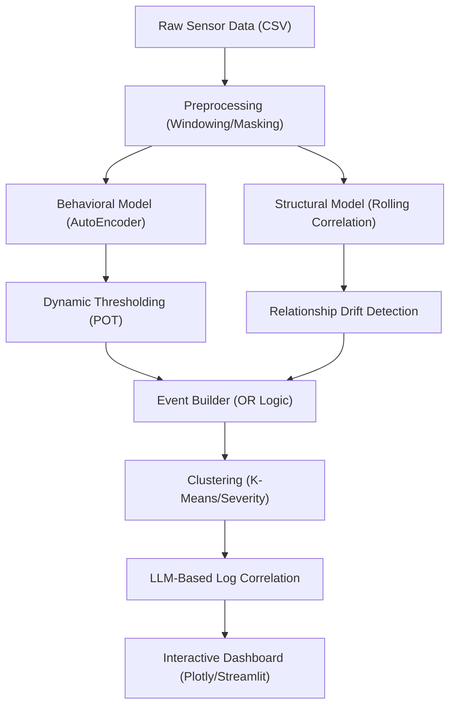

# Anomaly Detection & Diagnostic System

[](https://behackfest-svhjrashpisptdjz5kmjfw.streamlit.app/)

A powerful time-series anomaly detection system using AutoEncoders, Dynamic Thresholding (POT), and Interactive Plotly Dashboards.

🔗 **Live Demo**: [behackfest-svhjrashpisptdjz5kmjfw.streamlit.app](https://behackfest-svhjrashpisptdjz5kmjfw.streamlit.app/)

## 🛠️ Setup & Installation

Before running the application, install the required Python dependencies:

```bash
pip install streamlit plotly pandas numpy scikit-learn torch matplotlib kaleido nbformat
```

## 🚀 How to Run

### 1. Generate Sample Data
Create a set of synthetic sensor data and operator logs with pre-defined anomalies for testing:
```bash
python generate_data.py
```

### 2. Run the Processing Pipeline (CLI/Dev Mode)
Run the full detection and alignment logic to generate static and interactive reports:
```bash
python demo_app.py
```
**Outputs:**
- `anomaly_dashboard.html`: Fully interactive Plotly dashboard.
- `anomaly_events_plot.png`: Static image preview of the results.

### 3. Launch the Web Dashboard (Production UI)
Run the professional Streamlit interface for interactive data exploration and CSV uploads:
```bash
python -m streamlit run app.py
```
- Access it at: http://localhost:8502

## 🏗️ System Architecture



## 🧠 Core Components

- **AutoEncoder (Behavioral)**: A neural network trained on normal state data. It learns to reconstruct sensor patterns; high reconstruction error signals a behavioral anomaly.
- **Rolling Correlation (Structural)**: Monitors the relationships between sensor signals. If sensors that normally move together suddenly diverge, a structural anomaly is flagged.
- **Peak Over Threshold (POT)**: A dynamic thresholding strategy that adapts to data noise levels, ensuring the system remains sensitive without being overwhelmed by false positives.
- **LLM Parser**: Analyzes operator logs for keywords (Fault, Leak, Overload) to categorize human-observed issues alongside machine-detected anomalies.

## 📂 Project Structure

- `app.py`: Main Streamlit Web Application.
- `demo_app.py`: CLI-based detection pipeline.
- `anomaly_model.py`: AutoEncoder-based behavioral detection logic.
- `structure_model.py`: Rolling-correlation structural detection.
- `plotting.py`: Plotly-based visualization engine.
- `generate_data.py`: Synthetic data generator.
- `preprocessing.py`: Multi-sensor synchronization and windowing.
- `event_builder.py` & `clustering.py`: Event grouping and severity scoring.
- `llm_parser.py`: Semantic operator log parsing.

## 📊 Dashboard Elements
- **Red Regions**: High Severity Events (Cluster 1).
- **Orange/Yellow Regions**: Standard Anomaly Events (Cluster 0).
- **Red Stars**: Event Midpoints/Peaks.
- **Vertical Red Dashed Lines**: Operator Log entries (Hover to read text).

## 📄 License
This project is licensed under the MIT License - see the [LICENSE](LICENSE) file for details.
